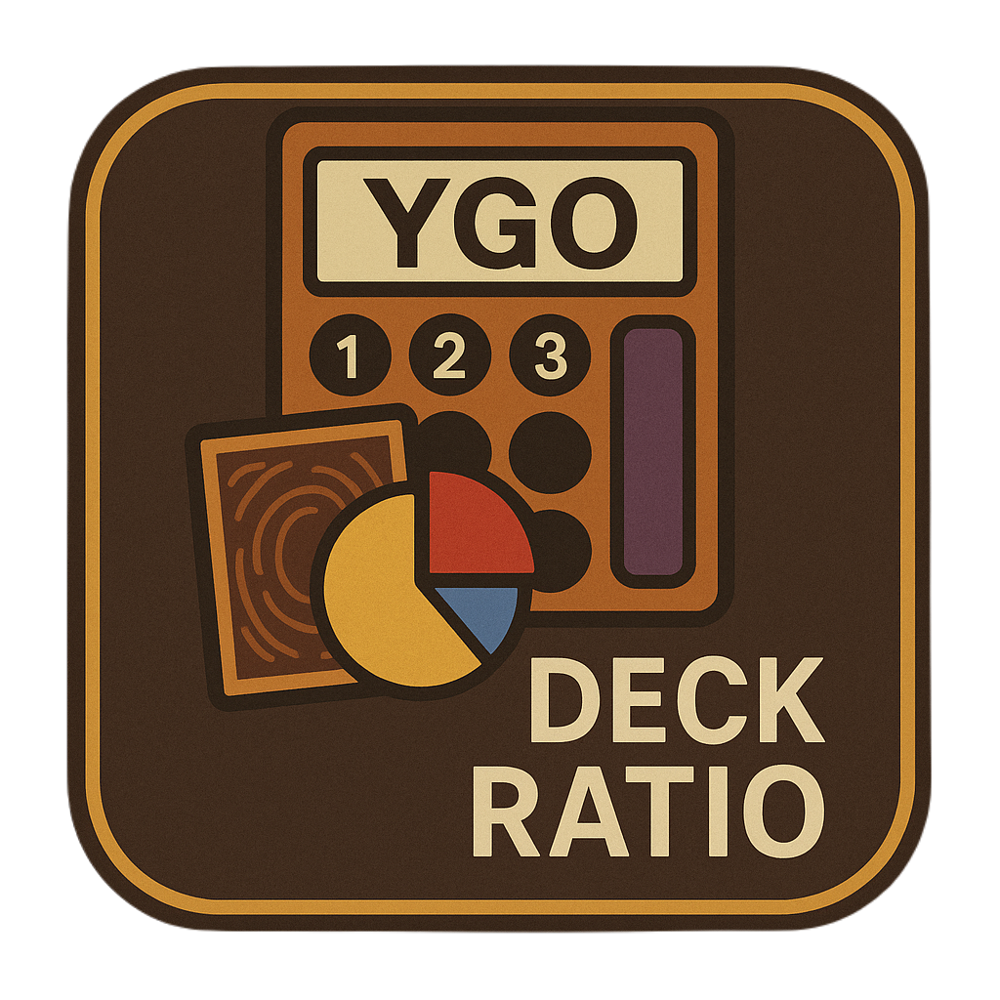

<!-- link to website -->

# Yu-Gi-Oh! Ratio Visualizer

This tool aims to help Yu-Gi-Oh! players visualize and adjust the card ratios in their decks to open better hands in games more consistently.

## Features
- Import your deck with a YDKE url or manually enter it in
- Check the detailed probability of opening starters for multiple engines
- Add custom tags to your cards and see the probability of opening cards per tag

<!-- ## How to use -->

Built with <a href="https://www.npmjs.com/package/ydke" target='_blank'>ydke.js</a> and <a href='https://ygoprodeck.com/api-guide/' target='_blank'>Yu-Gi-Oh! API by YGOPRODeck</a> 